# GAZ Barbershop Booking System

Website booking barbershop berbasis Laravel dan MySQL untuk membantu pelanggan melakukan pemesanan layanan cukur rambut secara online, memilih capster berdasarkan jadwal yang tersedia, menghitung total harga otomatis, serta membantu admin mengelola booking, capster, layanan, pembayaran, dan review pelanggan.

---

## 1. Deskripsi Project

**GAZ Barbershop Booking System** adalah aplikasi website untuk manajemen booking barbershop. Sistem ini memiliki dua sisi utama, yaitu:

1. **User / Member**

   * Registrasi dan login.
   * Melakukan booking layanan barbershop.
   * Memilih layanan seperti cukur rambut, cuci rambut, hair coloring, dan layanan lain.
   * Memilih capster berdasarkan jadwal yang tersedia.
   * Melihat total harga otomatis dari layanan dan jasa capster.
   * Mendapatkan notifikasi email jika booking batal otomatis atau perlu reschedule.
   * Memberikan review kepada capster setelah layanan selesai dan pembayaran sudah dilakukan.

2. **Admin**

   * Mengelola data booking pelanggan.
   * Mengirim konfirmasi booking ke WhatsApp pelanggan.
   * Menerima atau menolak booking berdasarkan respons pelanggan.
   * Mengelola data capster.
   * Mengelola layanan barbershop.
   * Mengelola jadwal capster.
   * Mengelola status pembayaran dan penyelesaian layanan.
   * Melihat review pelanggan terhadap capster.

---

## 2. Tech Stack

Project ini menggunakan teknologi berikut:

| Kebutuhan          | Teknologi                                  |
| ------------------ | ------------------------------------------ |
| Backend Framework  | Laravel 13.x                               |
| Bahasa Pemrograman | PHP 8.3+                                   |
| Database           | MySQL 8.4 LTS                              |
| Frontend           | Blade, Tailwind CSS, Vite                  |
| Authentication     | Laravel Breeze / Laravel Auth Starter Kit  |
| Email Notification | Laravel Mail / Notification via Gmail SMTP |
| Queue              | Laravel Queue                              |
| Scheduler          | Laravel Task Scheduling                    |
| ORM                | Eloquent ORM                               |
| Validation         | Laravel Form Request                       |
| Authorization      | Middleware Role Admin & User               |
| Testing            | PHPUnit / Pest                             |
| Deployment         | VPS / Shared Hosting / Cloud Server        |

---

## 3. Aktor Sistem

### 3.1 User / Member

User adalah pelanggan barbershop yang sudah melakukan registrasi dan login. User dapat melakukan booking, memilih layanan, memilih capster, menerima notifikasi, melakukan pembayaran, dan memberikan review setelah layanan selesai.

### 3.2 Admin

Admin adalah pengelola barbershop yang bertugas menerima booking, mengirim konfirmasi ke WhatsApp pelanggan, menerima atau menolak booking, mengelola capster, mengelola layanan, dan memastikan transaksi selesai.

### 3.3 Sistem

Sistem bertugas menjalankan proses otomatis seperti menghitung total harga, memeriksa ketersediaan jadwal, membatalkan booking jika tidak ada respons dalam batas waktu tertentu, membatalkan booking jika pelanggan terlambat, dan mengirim notifikasi email reschedule.

---

## 4. Fitur Utama

## 4.1 Fitur User

### Registrasi dan Login

User wajib memiliki akun terlebih dahulu agar bisa melakukan booking. Setelah registrasi, user akan menjadi member dan dapat mengakses fitur booking.

Fitur autentikasi user meliputi:

* Register akun.
* Login akun.
* Logout.
* Update profil.
* Melihat riwayat booking.
* Melihat status booking.

---

### Memilih Layanan Barbershop

User dapat memilih satu atau beberapa layanan yang tersedia, misalnya:

* Cukur rambut.
* Cukur rambut + cuci.
* Cuci rambut.
* Hair coloring.
* Hair styling.
* Shaving.
* Hair treatment.

Setiap layanan memiliki harga dan estimasi durasi.

Contoh:

| Layanan        |     Harga |   Durasi |
| -------------- | --------: | -------: |
| Cukur Rambut   |  Rp30.000 | 30 menit |
| Cukur + Cuci   |  Rp45.000 | 45 menit |
| Hair Coloring  | Rp120.000 | 90 menit |
| Hair Treatment |  Rp80.000 | 60 menit |

Jika user memilih lebih dari satu layanan, maka sistem akan menjumlahkan seluruh harga layanan.

Contoh:

```text
Cukur Rambut      = Rp30.000
Cuci Rambut       = Rp15.000
Hair Treatment    = Rp80.000
Total Layanan     = Rp125.000
```

---

### Memilih Capster

Setelah memilih layanan, user dapat memilih capster berdasarkan jadwal yang tersedia.

Data capster yang ditampilkan kepada user:

* Nama capster.
* Foto capster.
* Rating capster.
* Harga jasa capster.
* Jadwal tersedia.
* Status ketersediaan.

Harga jasa capster dapat berbeda-beda sesuai kualitas atau level capster.

Contoh:

| Capster | Rating | Harga Jasa |
| ------- | -----: | ---------: |
| Andi    |    4.9 |   Rp25.000 |
| Budi    |    4.7 |   Rp20.000 |
| Rizky   |    4.5 |   Rp15.000 |

---

### Perhitungan Total Harga

Total harga booking dihitung dari:

```text
Total Harga = Total Harga Layanan + Harga Jasa Capster
```

Contoh:

```text
Cukur Rambut       = Rp30.000
Cuci Rambut        = Rp15.000
Jasa Capster Andi  = Rp25.000

Total Harga        = Rp70.000
```

---

### Ketentuan Kehadiran User

User wajib datang paling lambat **15 menit sebelum jadwal booking dimulai**.

Contoh:

```text
Jadwal Booking: 14:00
Batas Check-in: 13:45
```

Jika user belum datang atau belum melakukan check-in sampai batas waktu tersebut, maka sistem akan membatalkan booking secara otomatis dan mengirimkan notifikasi email berisi pilihan untuk melakukan reschedule.

---

### Penyelesaian Layanan dan Review

Jika user datang tepat waktu, layanan sudah selesai, dan pembayaran sudah dilakukan, maka sistem akan menampilkan tombol:

```text
Selesai
```

Setelah tombol selesai ditekan, user akan diarahkan ke halaman review capster.

User dapat memberikan:

* Rating.
* Komentar.
* Penilaian pelayanan.
* Penilaian hasil cukur.
* Penilaian ketepatan waktu.

---

## 4.2 Fitur Admin

### Mengelola Booking

Admin dapat melihat daftar booking yang masuk dari pelanggan.

Informasi booking yang ditampilkan:

* Nama user.
* Nomor WhatsApp user.
* Layanan yang dipilih.
* Capster yang dipilih.
* Jadwal booking.
* Total harga.
* Status booking.
* Status pembayaran.

---

### Konfirmasi Booking via WhatsApp

Setelah booking masuk, admin akan melihat tombol:

```text
Konfirmasi via WhatsApp
```

Ketika tombol ditekan, sistem akan redirect ke WhatsApp dengan format pesan otomatis.

Contoh pesan WhatsApp:

```text
Halo Raihan, booking Anda di GAZ Barbershop sudah kami terima.

Detail Booking:
- Layanan: Cukur Rambut + Cuci
- Capster: Andi
- Jadwal: 12 Juni 2026, 14:00
- Total Harga: Rp70.000

Mohon konfirmasi apakah Anda jadi datang?
Balas: Jadi / Tidak Jadi

Terima kasih.
```

Setelah user memberikan respons di WhatsApp, admin dapat memilih:

* **Terima Booking**
* **Tolak Booking**

---

### Booking Batal Otomatis Jika Tidak Ada Respons

Jika user tidak memberikan respons setelah dikonfirmasi dalam waktu tertentu, misalnya 15 menit, maka sistem akan membatalkan booking secara otomatis.

Default konfigurasi:

```text
BOOKING_CONFIRMATION_TIMEOUT_MINUTES=15
```

Status booking akan berubah menjadi:

```text
AUTO_CANCELLED
```

---

### CRUD Capster

Admin dapat mengelola data capster.

Data capster meliputi:

* Nama capster.
* Foto capster.
* Rating capster.
* Harga jasa capster.
* Status aktif atau tidak aktif.
* Jadwal kerja capster.

Fitur CRUD capster:

* Tambah capster.
* Lihat detail capster.
* Edit capster.
* Hapus capster.
* Aktifkan/nonaktifkan capster.

---

### CRUD Layanan

Admin dapat mengelola layanan barbershop.

Data layanan meliputi:

* Nama layanan.
* Deskripsi layanan.
* Harga layanan.
* Durasi layanan.
* Status aktif atau tidak aktif.

---

### Mengelola Jadwal Capster

Admin dapat mengatur jadwal kerja capster berdasarkan tanggal dan jam.

Contoh:

| Capster | Tanggal    | Jam Mulai | Jam Selesai |
| ------- | ---------- | --------: | ----------: |
| Andi    | 2026-06-12 |     10:00 |       18:00 |
| Budi    | 2026-06-12 |     12:00 |       20:00 |

Sistem hanya akan menampilkan capster yang memiliki jadwal tersedia dan belum dibooking pada jam yang sama.

---

## 5. Alur Booking User

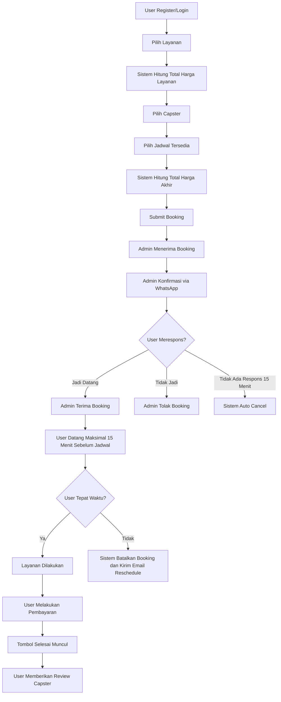

---

## 6. Alur Admin

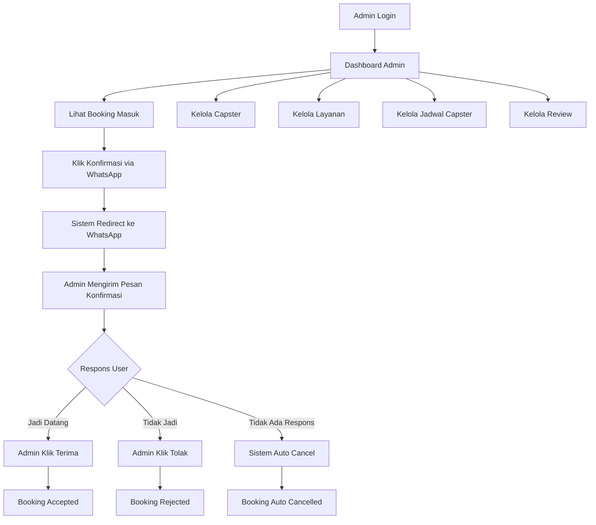

---

## 7. Status Booking

| Status                          | Keterangan                                                            |
| ------------------------------- | --------------------------------------------------------------------- |
| `PENDING`                       | Booking baru dibuat oleh user dan menunggu tindakan admin.            |
| `WAITING_CUSTOMER_CONFIRMATION` | Admin sudah mengirim konfirmasi ke WhatsApp, menunggu respons user.   |
| `ACCEPTED`                      | User menyatakan jadi datang dan admin menerima booking.               |
| `REJECTED`                      | User tidak jadi datang atau admin menolak booking.                    |
| `AUTO_CANCELLED`                | Booking batal otomatis karena user tidak merespons dalam batas waktu. |
| `LATE_CANCELLED`                | Booking batal otomatis karena user terlambat datang/check-in.         |
| `RESCHEDULE_OFFERED`            | Sistem mengirim pilihan reschedule ke email user.                     |
| `CHECKED_IN`                    | User sudah datang dan melakukan check-in.                             |
| `IN_PROGRESS`                   | Layanan sedang dilakukan oleh capster.                                |
| `WAITING_PAYMENT`               | Layanan selesai dan menunggu pembayaran.                              |
| `PAID`                          | User sudah melakukan pembayaran.                                      |
| `COMPLETED`                     | Booking selesai.                                                      |
| `REVIEWED`                      | User sudah memberikan review kepada capster.                          |

---

## 8. Aturan Bisnis Booking

### 8.1 User Wajib Login

User harus login sebelum dapat melakukan booking.

Jika belum login, user akan diarahkan ke halaman login/register.

---

### 8.2 User Bisa Memilih Banyak Layanan

User dapat memilih satu atau lebih layanan. Sistem akan menghitung total harga layanan secara otomatis.

Rumus:

```text
Total Layanan = SUM(harga_layanan)
```

---

### 8.3 User Memilih Capster Berdasarkan Jadwal

Sistem hanya menampilkan capster yang:

* Aktif.
* Memiliki jadwal kerja pada tanggal yang dipilih.
* Tidak sedang memiliki booking lain pada jam yang sama.
* Jadwalnya cukup untuk total durasi layanan yang dipilih.

---

### 8.4 Total Harga Booking

Rumus:

```text
Total Harga = Total Harga Layanan + Harga Jasa Capster
```

Contoh:

```text
Layanan:
- Cukur Rambut: Rp30.000
- Cuci Rambut: Rp15.000

Capster:
- Andi: Rp25.000

Total:
Rp30.000 + Rp15.000 + Rp25.000 = Rp70.000
```

---

### 8.5 Booking Tidak Boleh Bentrok

Capster tidak boleh menerima dua booking pada waktu yang sama.

Validasi bentrok jadwal:

```text
Booking baru tidak valid jika:
start_time < existing_end_time
DAN
end_time > existing_start_time
```

---

### 8.6 Timeout Konfirmasi Booking

Jika admin sudah mengirim konfirmasi ke WhatsApp dan user tidak memberikan respons dalam 15 menit, maka booking otomatis dibatalkan.

---

### 8.7 Batas Kedatangan User

User harus datang maksimal 15 menit sebelum jadwal dimulai.

Contoh:

```text
Jadwal booking: 14:00
Batas user datang: 13:45
```

Jika user belum check-in sampai 13:45, maka sistem otomatis membatalkan booking dan mengirim email reschedule.

---

### 8.8 Review Hanya Bisa Setelah Booking Selesai

User hanya bisa memberikan review jika:

* Booking sudah selesai.
* Pembayaran sudah dilakukan.
* User belum pernah memberikan review untuk booking tersebut.

---

## 9. Desain Database

## 9.1 Entity Relationship Diagram

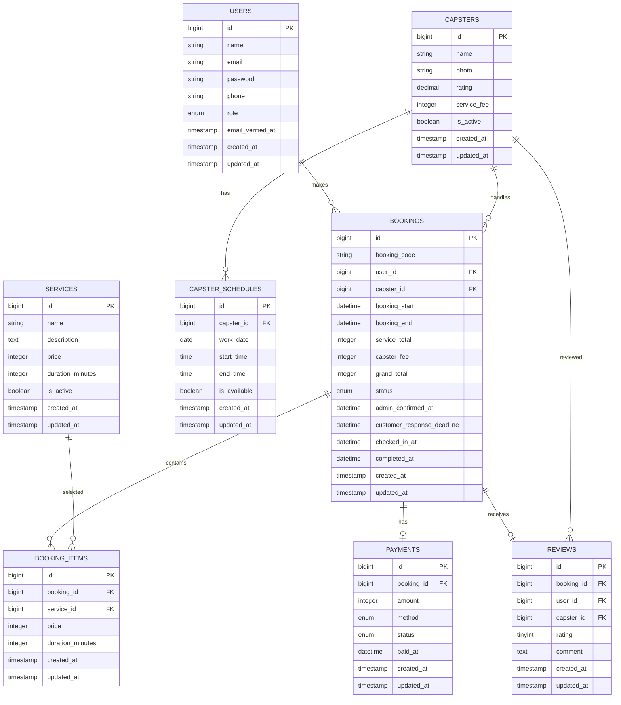

---

## 9.2 Tabel Users

Menyimpan data user dan admin.

| Field             | Type               | Keterangan             |
| ----------------- | ------------------ | ---------------------- |
| id                | bigint             | Primary key            |
| name              | varchar            | Nama user              |
| email             | varchar            | Email login            |
| password          | varchar            | Password hash          |
| phone             | varchar            | Nomor WhatsApp         |
| role              | enum               | `admin` atau `user`    |
| email_verified_at | timestamp nullable | Waktu verifikasi email |
| created_at        | timestamp          | Waktu dibuat           |
| updated_at        | timestamp          | Waktu update           |

---

## 9.3 Tabel Capsters

Menyimpan data capster/tukang cukur.

| Field       | Type             | Keterangan               |
| ----------- | ---------------- | ------------------------ |
| id          | bigint           | Primary key              |
| name        | varchar          | Nama capster             |
| photo       | varchar nullable | Foto capster             |
| rating      | decimal          | Rating rata-rata capster |
| service_fee | integer          | Harga jasa capster       |
| is_active   | boolean          | Status aktif             |
| created_at  | timestamp        | Waktu dibuat             |
| updated_at  | timestamp        | Waktu update             |

---

## 9.4 Tabel Services

Menyimpan daftar layanan barbershop.

| Field            | Type          | Keterangan        |
| ---------------- | ------------- | ----------------- |
| id               | bigint        | Primary key       |
| name             | varchar       | Nama layanan      |
| description      | text nullable | Deskripsi layanan |
| price            | integer       | Harga layanan     |
| duration_minutes | integer       | Durasi layanan    |
| is_active        | boolean       | Status aktif      |
| created_at       | timestamp     | Waktu dibuat      |
| updated_at       | timestamp     | Waktu update      |

---

## 9.5 Tabel Capster Schedules

Menyimpan jadwal kerja capster.

| Field        | Type      | Keterangan             |
| ------------ | --------- | ---------------------- |
| id           | bigint    | Primary key            |
| capster_id   | foreignId | Relasi ke capsters     |
| work_date    | date      | Tanggal kerja          |
| start_time   | time      | Jam mulai kerja        |
| end_time     | time      | Jam selesai kerja      |
| is_available | boolean   | Status jadwal tersedia |
| created_at   | timestamp | Waktu dibuat           |
| updated_at   | timestamp | Waktu update           |

---

## 9.6 Tabel Bookings

Menyimpan data booking user.

| Field                      | Type              | Keterangan                   |
| -------------------------- | ----------------- | ---------------------------- |
| id                         | bigint            | Primary key                  |
| booking_code               | varchar           | Kode booking unik            |
| user_id                    | foreignId         | Relasi ke user               |
| capster_id                 | foreignId         | Relasi ke capster            |
| booking_start              | datetime          | Jadwal mulai booking         |
| booking_end                | datetime          | Jadwal selesai booking       |
| service_total              | integer           | Total harga layanan          |
| capster_fee                | integer           | Harga jasa capster           |
| grand_total                | integer           | Total akhir                  |
| status                     | enum              | Status booking               |
| admin_confirmed_at         | datetime nullable | Waktu admin kirim konfirmasi |
| customer_response_deadline | datetime nullable | Batas respons user           |
| checked_in_at              | datetime nullable | Waktu user check-in          |
| completed_at               | datetime nullable | Waktu layanan selesai        |
| created_at                 | timestamp         | Waktu dibuat                 |
| updated_at                 | timestamp         | Waktu update                 |

---

## 9.7 Tabel Booking Items

Menyimpan layanan yang dipilih dalam satu booking.

| Field            | Type      | Keterangan                         |
| ---------------- | --------- | ---------------------------------- |
| id               | bigint    | Primary key                        |
| booking_id       | foreignId | Relasi ke bookings                 |
| service_id       | foreignId | Relasi ke services                 |
| price            | integer   | Harga layanan saat booking dibuat  |
| duration_minutes | integer   | Durasi layanan saat booking dibuat |
| created_at       | timestamp | Waktu dibuat                       |
| updated_at       | timestamp | Waktu update                       |

---

## 9.8 Tabel Payments

Menyimpan data pembayaran booking.

| Field      | Type              | Keterangan                 |
| ---------- | ----------------- | -------------------------- |
| id         | bigint            | Primary key                |
| booking_id | foreignId         | Relasi ke bookings         |
| amount     | integer           | Jumlah pembayaran          |
| method     | enum              | `cash`, `transfer`, `qris` |
| status     | enum              | `unpaid`, `paid`, `failed` |
| paid_at    | datetime nullable | Waktu pembayaran           |
| created_at | timestamp         | Waktu dibuat               |
| updated_at | timestamp         | Waktu update               |

---

## 9.9 Tabel Reviews

Menyimpan review user terhadap capster.

| Field      | Type          | Keterangan         |
| ---------- | ------------- | ------------------ |
| id         | bigint        | Primary key        |
| booking_id | foreignId     | Relasi ke bookings |
| user_id    | foreignId     | Relasi ke users    |
| capster_id | foreignId     | Relasi ke capsters |
| rating     | tinyint       | Rating 1 sampai 5  |
| comment    | text nullable | Komentar user      |
| created_at | timestamp     | Waktu dibuat       |
| updated_at | timestamp     | Waktu update       |

---

## 10. Struktur Folder Laravel

```text
gaz-barbershop/
├── app/
│   ├── Console/
│   │   └── Commands/
│   │       ├── AutoCancelUnconfirmedBookings.php
│   │       └── AutoCancelLateBookings.php
│   ├── Enums/
│   │   ├── BookingStatus.php
│   │   └── PaymentStatus.php
│   ├── Http/
│   │   ├── Controllers/
│   │   │   ├── User/
│   │   │   │   ├── BookingController.php
│   │   │   │   ├── ReviewController.php
│   │   │   │   └── ProfileController.php
│   │   │   └── Admin/
│   │   │       ├── DashboardController.php
│   │   │       ├── BookingController.php
│   │   │       ├── CapsterController.php
│   │   │       ├── ServiceController.php
│   │   │       └── CapsterScheduleController.php
│   │   ├── Middleware/
│   │   │   └── EnsureUserHasRole.php
│   │   └── Requests/
│   │       ├── StoreBookingRequest.php
│   │       ├── StoreCapsterRequest.php
│   │       ├── StoreServiceRequest.php
│   │       └── StoreReviewRequest.php
│   ├── Mail/
│   │   └── BookingRescheduleMail.php
│   ├── Models/
│   │   ├── User.php
│   │   ├── Capster.php
│   │   ├── Service.php
│   │   ├── CapsterSchedule.php
│   │   ├── Booking.php
│   │   ├── BookingItem.php
│   │   ├── Payment.php
│   │   └── Review.php
│   ├── Notifications/
│   │   └── BookingRescheduleNotification.php
│   └── Services/
│       ├── BookingService.php
│       ├── PricingService.php
│       ├── ScheduleService.php
│       └── WhatsAppRedirectService.php
├── database/
│   ├── migrations/
│   ├── seeders/
│   │   ├── UserSeeder.php
│   │   ├── CapsterSeeder.php
│   │   └── ServiceSeeder.php
├── resources/
│   ├── views/
│   │   ├── user/
│   │   │   ├── bookings/
│   │   │   ├── reviews/
│   │   │   └── profile/
│   │   ├── admin/
│   │   │   ├── dashboard/
│   │   │   ├── bookings/
│   │   │   ├── capsters/
│   │   │   ├── services/
│   │   │   └── schedules/
│   │   └── layouts/
│   ├── css/
│   └── js/
├── routes/
│   ├── web.php
│   └── auth.php
├── tests/
│   ├── Feature/
│   └── Unit/
├── .env.example
├── composer.json
├── package.json
└── README.md
```

---

## 11. Route Website

## 11.1 Public Route

| Method | Endpoint    | Keterangan       |
| ------ | ----------- | ---------------- |
| GET    | `/`         | Landing page     |
| GET    | `/services` | Daftar layanan   |
| GET    | `/capsters` | Daftar capster   |
| GET    | `/login`    | Halaman login    |
| GET    | `/register` | Halaman register |

---

## 11.2 User Route

Route ini hanya bisa diakses oleh user yang sudah login.

```php
Route::middleware(['auth', 'role:user'])->prefix('member')->name('member.')->group(function () {
    Route::get('/dashboard', [UserDashboardController::class, 'index'])->name('dashboard');

    Route::get('/bookings', [BookingController::class, 'index'])->name('bookings.index');
    Route::get('/bookings/create', [BookingController::class, 'create'])->name('bookings.create');
    Route::post('/bookings', [BookingController::class, 'store'])->name('bookings.store');
    Route::get('/bookings/{booking}', [BookingController::class, 'show'])->name('bookings.show');

    Route::post('/bookings/{booking}/complete', [BookingController::class, 'complete'])->name('bookings.complete');

    Route::get('/bookings/{booking}/review', [ReviewController::class, 'create'])->name('reviews.create');
    Route::post('/bookings/{booking}/review', [ReviewController::class, 'store'])->name('reviews.store');
});
```

---

## 11.3 Admin Route

Route ini hanya bisa diakses oleh admin.

```php
Route::middleware(['auth', 'role:admin'])->prefix('admin')->name('admin.')->group(function () {
    Route::get('/dashboard', [AdminDashboardController::class, 'index'])->name('dashboard');

    Route::get('/bookings', [AdminBookingController::class, 'index'])->name('bookings.index');
    Route::get('/bookings/{booking}', [AdminBookingController::class, 'show'])->name('bookings.show');
    Route::post('/bookings/{booking}/confirm-whatsapp', [AdminBookingController::class, 'confirmWhatsApp'])->name('bookings.confirm-whatsapp');
    Route::post('/bookings/{booking}/accept', [AdminBookingController::class, 'accept'])->name('bookings.accept');
    Route::post('/bookings/{booking}/reject', [AdminBookingController::class, 'reject'])->name('bookings.reject');
    Route::post('/bookings/{booking}/check-in', [AdminBookingController::class, 'checkIn'])->name('bookings.check-in');
    Route::post('/bookings/{booking}/start-service', [AdminBookingController::class, 'startService'])->name('bookings.start-service');
    Route::post('/bookings/{booking}/mark-paid', [AdminBookingController::class, 'markPaid'])->name('bookings.mark-paid');

    Route::resource('/capsters', CapsterController::class);
    Route::resource('/services', ServiceController::class);
    Route::resource('/capster-schedules', CapsterScheduleController::class);
});
```

---

## 12. Contoh Model Relationship

### User Model

```php
public function bookings()
{
    return $this->hasMany(Booking::class);
}

public function reviews()
{
    return $this->hasMany(Review::class);
}
```

---

### Capster Model

```php
public function bookings()
{
    return $this->hasMany(Booking::class);
}

public function schedules()
{
    return $this->hasMany(CapsterSchedule::class);
}

public function reviews()
{
    return $this->hasMany(Review::class);
}
```

---

### Booking Model

```php
public function user()
{
    return $this->belongsTo(User::class);
}

public function capster()
{
    return $this->belongsTo(Capster::class);
}

public function items()
{
    return $this->hasMany(BookingItem::class);
}

public function payment()
{
    return $this->hasOne(Payment::class);
}

public function review()
{
    return $this->hasOne(Review::class);
}
```

---

## 13. Konfigurasi Environment

Contoh konfigurasi `.env`:

```env
APP_NAME="GAZ Barbershop"
APP_ENV=local
APP_KEY=
APP_DEBUG=true
APP_URL=http://localhost:8000

DB_CONNECTION=mysql
DB_HOST=127.0.0.1
DB_PORT=3306
DB_DATABASE=gaz_barbershop
DB_USERNAME=root
DB_PASSWORD=

MAIL_MAILER=smtp
MAIL_HOST=smtp.gmail.com
MAIL_PORT=587
MAIL_USERNAME=your_gmail@gmail.com
MAIL_PASSWORD=your_gmail_app_password
MAIL_ENCRYPTION=tls
MAIL_FROM_ADDRESS=your_gmail@gmail.com
MAIL_FROM_NAME="GAZ Barbershop"

QUEUE_CONNECTION=database

BOOKING_CONFIRMATION_TIMEOUT_MINUTES=15
BOOKING_ARRIVAL_BEFORE_MINUTES=15

WHATSAPP_COUNTRY_CODE=62
```

Catatan:

* Gunakan **Gmail App Password**, bukan password akun Gmail biasa.
* Pastikan queue worker aktif agar email notifikasi dapat dikirim.
* Pastikan scheduler aktif agar proses auto-cancel berjalan.

---

## 14. Instalasi Project

### 14.1 Clone Repository

```bash
git clone https://github.com/username/gaz-barbershop.git
cd gaz-barbershop
```

---

### 14.2 Install Dependency Backend

```bash
composer install
```

---

### 14.3 Install Dependency Frontend

```bash
npm install
```

---

### 14.4 Copy File Environment

```bash
cp .env.example .env
```

---

### 14.5 Generate App Key

```bash
php artisan key:generate
```

---

### 14.6 Buat Database MySQL

Buat database baru:

```sql
CREATE DATABASE gaz_barbershop;
```

Lalu sesuaikan konfigurasi `.env`:

```env
DB_DATABASE=gaz_barbershop
DB_USERNAME=root
DB_PASSWORD=
```

---

### 14.7 Jalankan Migration dan Seeder

```bash
php artisan migrate --seed
```

---

### 14.8 Jalankan Storage Link

```bash
php artisan storage:link
```

---

### 14.9 Jalankan Aplikasi

```bash
php artisan serve
```

Jalankan Vite:

```bash
npm run dev
```

Akses aplikasi:

```text
http://localhost:8000
```

---

## 15. Queue dan Scheduler

Project ini membutuhkan queue dan scheduler untuk menjalankan proses otomatis.

### 15.1 Jalankan Queue Worker

```bash
php artisan queue:work
```

Queue digunakan untuk:

* Mengirim email reschedule.
* Mengirim notifikasi booking.
* Memproses pekerjaan background lain.

---

### 15.2 Jalankan Scheduler di Local

```bash
php artisan schedule:work
```

Scheduler digunakan untuk:

* Auto-cancel booking jika user tidak merespons.
* Auto-cancel booking jika user terlambat check-in.
* Mengirim notifikasi reschedule.

---

## 16. Command Otomatis

### Auto Cancel Unconfirmed Booking

Command ini mengecek booking dengan status `WAITING_CUSTOMER_CONFIRMATION`.

Jika waktu sekarang sudah melewati `customer_response_deadline`, maka status booking berubah menjadi `AUTO_CANCELLED`.

Contoh command:

```bash
php artisan bookings:auto-cancel-unconfirmed
```

---

### Auto Cancel Late Booking

Command ini mengecek booking dengan status `ACCEPTED`.

Jika user belum check-in sampai 15 menit sebelum jadwal dimulai, maka status booking berubah menjadi `LATE_CANCELLED` dan sistem mengirim email reschedule.

Contoh command:

```bash
php artisan bookings:auto-cancel-late
```

---

## 17. Contoh Jadwal Scheduler

Di Laravel scheduler, command dapat dijalankan setiap menit.

```php
use Illuminate\Support\Facades\Schedule;

Schedule::command('bookings:auto-cancel-unconfirmed')->everyMinute();
Schedule::command('bookings:auto-cancel-late')->everyMinute();
```

---

## 18. Contoh Format Redirect WhatsApp

Ketika admin klik tombol konfirmasi, sistem membuat URL WhatsApp:

```text
https://wa.me/628xxxxxxxxxx?text=ISI_PESAN
```

Contoh pesan:

```text
Halo {nama_user}, booking Anda di GAZ Barbershop sudah kami terima.

Detail Booking:
- Kode Booking: {booking_code}
- Layanan: {services}
- Capster: {capster_name}
- Jadwal: {booking_date_time}
- Total Harga: {grand_total}

Mohon konfirmasi apakah Anda jadi datang.
Balas: Jadi / Tidak Jadi

Terima kasih.
```

Setelah pesan dikirim, status booking berubah menjadi:

```text
WAITING_CUSTOMER_CONFIRMATION
```

Dan sistem menyimpan:

```text
admin_confirmed_at = waktu sekarang
customer_response_deadline = waktu sekarang + 15 menit
```

---

## 19. Flow Pembayaran

Pembayaran dapat dilakukan setelah layanan selesai.

Status pembayaran:

| Status   | Keterangan       |
| -------- | ---------------- |
| `unpaid` | Belum dibayar    |
| `paid`   | Sudah dibayar    |
| `failed` | Pembayaran gagal |

Metode pembayaran:

| Method     | Keterangan            |
| ---------- | --------------------- |
| `cash`     | Bayar tunai di tempat |
| `transfer` | Transfer bank         |
| `qris`     | Pembayaran QRIS       |

Setelah admin menandai pembayaran sebagai `paid`, user dapat menekan tombol `Selesai` dan memberikan review.

---

## 20. Flow Review Capster

Review hanya dapat diberikan jika:

* Booking milik user tersebut.
* Booking sudah selesai.
* Pembayaran sudah `paid`.
* User belum pernah memberikan review untuk booking tersebut.

Setelah review dibuat:

* Rating capster dihitung ulang.
* Status booking berubah menjadi `REVIEWED`.

Rumus rating capster:

```text
Rating Capster = AVG(rating dari semua review capster)
```

---

## 21. Validasi Penting

### Validasi Booking

* User wajib login.
* Minimal memilih satu layanan.
* Capster wajib dipilih.
* Jadwal wajib dipilih.
* Jadwal tidak boleh bentrok.
* Capster harus aktif.
* Layanan harus aktif.
* Booking tidak boleh dibuat untuk tanggal yang sudah lewat.
* Total durasi layanan harus muat dalam jadwal kerja capster.

---

### Validasi Capster

* Nama wajib diisi.
* Foto harus berupa gambar.
* Harga jasa wajib angka.
* Rating default 0.
* Status aktif default true.

---

### Validasi Layanan

* Nama layanan wajib diisi.
* Harga wajib angka.
* Durasi wajib angka dalam menit.
* Status aktif default true.

---

### Validasi Review

* Rating wajib angka 1 sampai 5.
* Komentar boleh kosong.
* User hanya boleh review satu kali untuk satu booking.
* Review hanya boleh dilakukan setelah pembayaran selesai.

---

## 22. Role dan Authorization

Sistem memiliki dua role utama:

```text
admin
user
```

Contoh middleware:

```text
role:admin
role:user
```

Hak akses:

| Fitur                   |  User | Admin |
| ----------------------- | :---: | :---: |
| Register/Login          |   Ya  |   Ya  |
| Booking layanan         |   Ya  | Tidak |
| Pilih capster           |   Ya  | Tidak |
| Melihat booking pribadi |   Ya  | Tidak |
| Review capster          |   Ya  | Tidak |
| Melihat semua booking   | Tidak |   Ya  |
| Konfirmasi WhatsApp     | Tidak |   Ya  |
| Terima/Tolak booking    | Tidak |   Ya  |
| CRUD capster            | Tidak |   Ya  |
| CRUD layanan            | Tidak |   Ya  |
| CRUD jadwal capster     | Tidak |   Ya  |
| Update pembayaran       | Tidak |   Ya  |

---

## 23. Contoh Data Seeder

### Admin

```text
Name: Admin GAZ
Email: admin@gazbarbershop.com
Password: password
Role: admin
```

---

### User

```text
Name: Member Demo
Email: user@gazbarbershop.com
Password: password
Role: user
```

---

### Capster

| Nama  | Rating | Harga Jasa |
| ----- | -----: | ---------: |
| Andi  |    4.9 |   Rp25.000 |
| Budi  |    4.7 |   Rp20.000 |
| Rizky |    4.5 |   Rp15.000 |

---

### Layanan

| Nama           |     Harga |   Durasi |
| -------------- | --------: | -------: |
| Cukur Rambut   |  Rp30.000 | 30 menit |
| Cukur + Cuci   |  Rp45.000 | 45 menit |
| Hair Coloring  | Rp120.000 | 90 menit |
| Hair Treatment |  Rp80.000 | 60 menit |

---

## 24. Testing

Jalankan test:

```bash
php artisan test
```

Rekomendasi test yang perlu dibuat:

* User dapat register dan login.
* User dapat membuat booking.
* User tidak bisa booking tanpa login.
* Sistem menghitung total harga dengan benar.
* Sistem menolak booking jika jadwal capster bentrok.
* Admin dapat mengirim konfirmasi WhatsApp.
* Booking auto-cancel jika user tidak merespons.
* Booking auto-cancel jika user terlambat check-in.
* User dapat review setelah booking selesai dan pembayaran paid.
* User tidak dapat review booking orang lain.
* Admin dapat CRUD capster.
* Admin dapat CRUD layanan.

---

## 25. Security

Beberapa keamanan yang perlu diterapkan:

* Password user wajib di-hash.
* Route admin dilindungi middleware.
* User hanya bisa melihat booking miliknya sendiri.
* Validasi input menggunakan Form Request.
* Upload foto capster hanya menerima file gambar.
* Gunakan CSRF protection untuk form.
* Gunakan authorization policy untuk booking dan review.
* Jangan menyimpan password Gmail asli di repository.
* Gunakan `.env` untuk data sensitif.
* Batasi ukuran file upload.
* Gunakan HTTPS di production.

---

## 26. Deployment

Langkah umum deployment:

1. Upload project ke server.
2. Jalankan `composer install --no-dev --optimize-autoloader`.
3. Jalankan `npm install && npm run build`.
4. Atur file `.env` production.
5. Jalankan `php artisan key:generate`.
6. Jalankan `php artisan migrate --force`.
7. Jalankan `php artisan storage:link`.
8. Jalankan cache optimization:

```bash
php artisan config:cache
php artisan route:cache
php artisan view:cache
```

9. Jalankan queue worker menggunakan Supervisor.
10. Jalankan scheduler menggunakan cron.

Contoh cron scheduler:

```bash
* * * * * cd /path/to/gaz-barbershop && php artisan schedule:run >> /dev/null 2>&1
```

---


---

## 29. Visual Layout UI/UX

Bagian ini berisi referensi visual untuk implementasi UI/UX website **GAZ Barbershop Booking System**. Visual ini dibuat agar proses slicing frontend lebih jelas, baik untuk tampilan desktop, mobile, maupun dashboard admin.

### 29.1 Konsep UI/UX

Konsep desain yang digunakan adalah **premium dark barbershop interface** dengan aksen warna emas. Tujuannya agar website terlihat profesional, maskulin, modern, dan tetap mudah digunakan oleh pelanggan maupun admin.

Prinsip desain:

* **Dark premium layout** untuk memberi kesan eksklusif.
* **Gold accent** untuk tombol utama, rating, badge, dan highlight harga.
* **Card-based layout** untuk layanan, capster, booking, dan status.
* **Mobile-first responsive** agar user mudah booking dari handphone.
* **Booking wizard** agar user tidak bingung saat memilih layanan, capster, jadwal, dan ringkasan harga.
* **Admin dashboard compact** agar admin cepat melihat booking masuk dan melakukan konfirmasi WhatsApp.

---

### 29.2 Visual Blueprint Layout

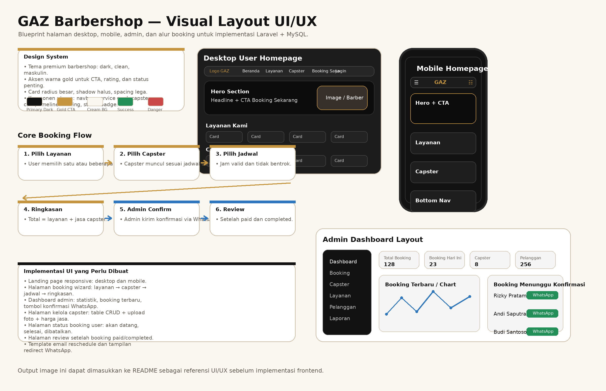

Blueprint ini menjelaskan struktur utama UI/UX:

* Landing page desktop.
* Landing page mobile.
* Booking flow user.
* Dashboard admin.
* Komponen penting seperti service card, capster card, status booking, review, email notification, dan WhatsApp confirmation.

---

### 29.3 Preview UI/UX Full Overview

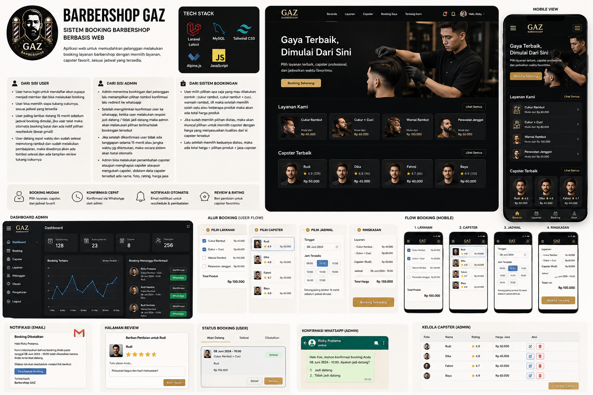

---

### 29.4 Tampilan Branding dan Ringkasan Project

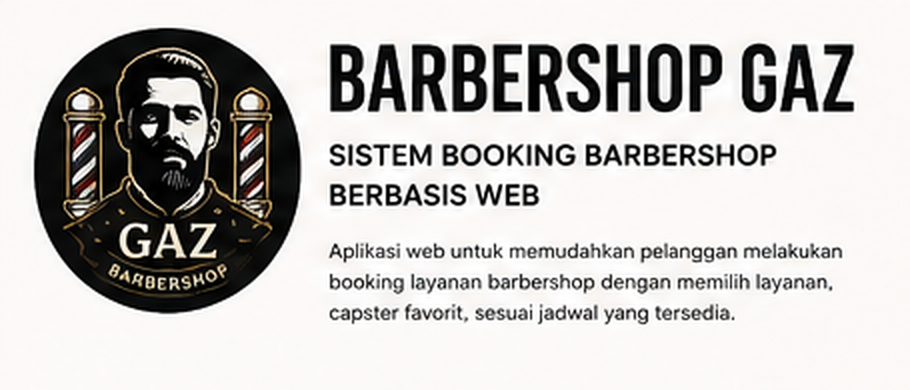

Bagian ini digunakan sebagai referensi header dokumentasi, identitas aplikasi, dan ringkasan fungsi utama website.

---

### 29.5 Tampilan Tech Stack

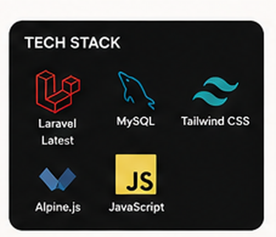

Bagian ini menjelaskan stack utama yang digunakan, yaitu Laravel, MySQL, Tailwind CSS, Alpine.js, dan JavaScript.

---

### 29.6 Tampilan Scope Fitur User, Admin, dan Sistem Booking

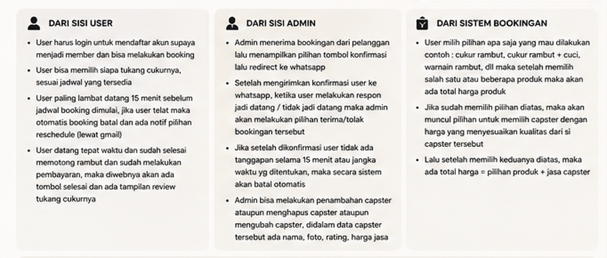

Visual ini memisahkan kebutuhan sistem menjadi tiga bagian:

* Dari sisi user.
* Dari sisi admin.
* Dari sisi sistem booking.

---

### 29.7 Tampilan Benefit Utama

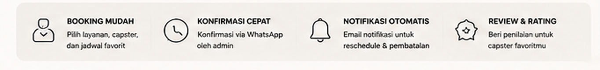

Benefit utama yang ditampilkan:

* Booking mudah.
* Konfirmasi cepat via WhatsApp.
* Notifikasi otomatis via email.
* Review dan rating capster.

---

### 29.8 Tampilan Desktop User Homepage

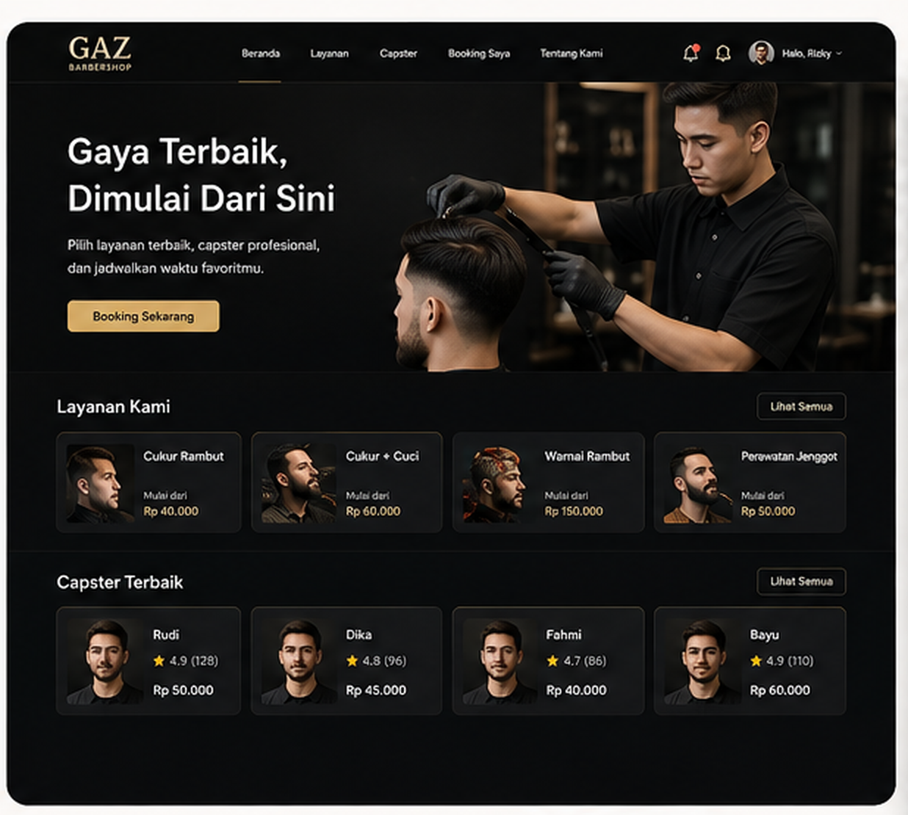

Struktur desktop homepage:

* Navbar berisi logo, beranda, layanan, capster, booking saya, dan profil user.
* Hero section dengan headline dan CTA booking.
* Section layanan.
* Section capster terbaik.
* Card harga dan rating.

---

### 29.9 Tampilan Mobile Homepage

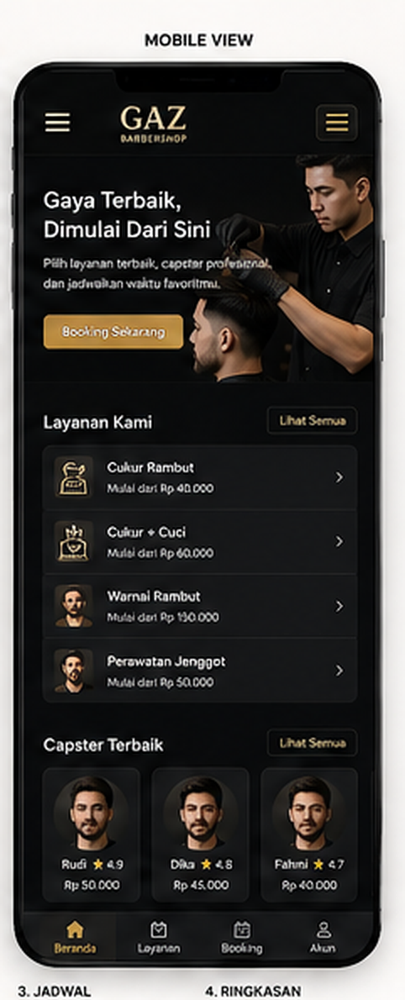

Struktur mobile homepage:

* Header compact dengan hamburger menu.
* Hero section pendek.
* List layanan berbentuk card vertikal.
* List capster terbaik.
* Bottom navigation untuk akses cepat.

---

### 29.10 Tampilan Dashboard Admin

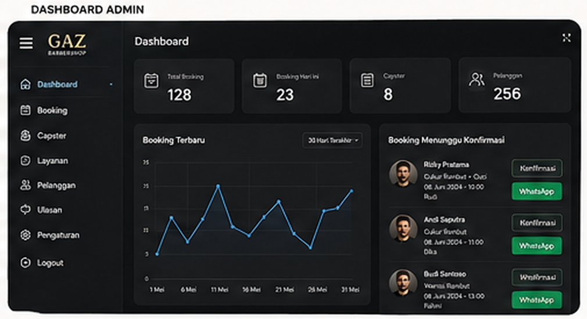

Dashboard admin menampilkan:

* Sidebar menu.
* Statistik total booking.
* Booking hari ini.
* Total capster.
* Total pelanggan.
* Chart booking terbaru.
* Daftar booking yang menunggu konfirmasi.
* Tombol konfirmasi WhatsApp.

---

### 29.11 Tampilan Alur Booking Desktop

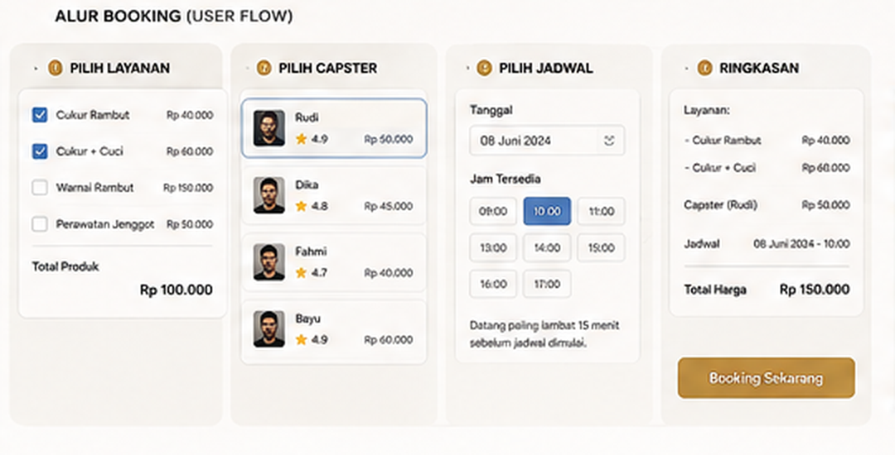

Alur booking desktop menggunakan model wizard:

1. Pilih layanan.
2. Pilih capster.
3. Pilih jadwal.
4. Lihat ringkasan dan total harga.
5. Klik tombol booking sekarang.

---

### 29.12 Tampilan Alur Booking Mobile

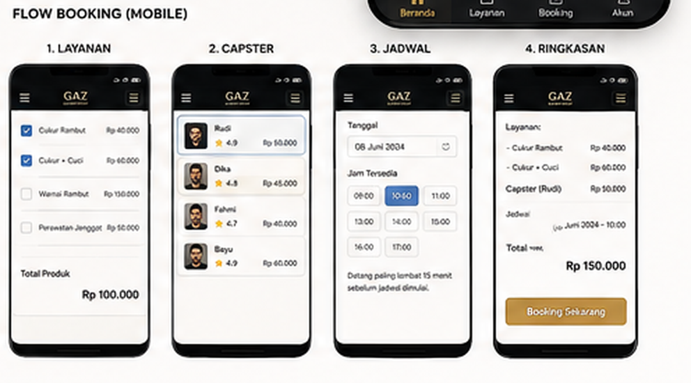

Alur booking mobile dibuat per step agar tampilan tidak terlalu padat di layar kecil.

Urutan screen mobile:

1. Layanan.
2. Capster.
3. Jadwal.
4. Ringkasan.

---

### 29.13 Tampilan Notifikasi Email Reschedule

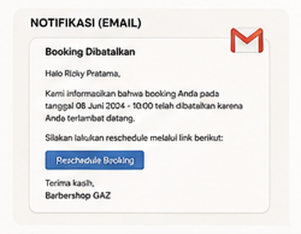

Email ini dikirim ketika booking batal otomatis karena user terlambat datang atau tidak melakukan check-in sesuai batas waktu.

---

### 29.14 Tampilan Halaman Review

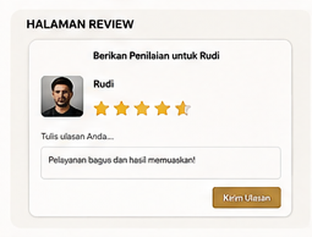

Halaman review muncul setelah:

* Layanan selesai.
* Pembayaran sudah dilakukan.
* Booking sudah berstatus completed atau paid.

---

### 29.15 Tampilan Status Booking User

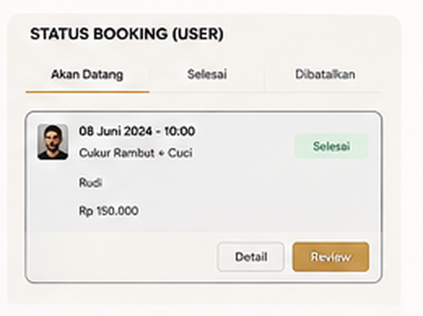

Halaman ini digunakan user untuk melihat status booking:

* Akan datang.
* Selesai.
* Dibatalkan.

---

### 29.16 Tampilan Konfirmasi WhatsApp Admin

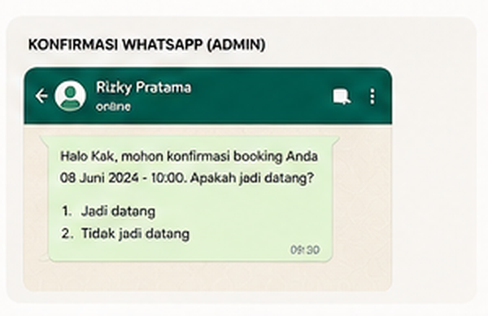

Visual ini menjadi referensi alur ketika admin menghubungi user melalui WhatsApp untuk konfirmasi jadi datang atau tidak jadi datang.

---

### 29.17 Tampilan Kelola Capster Admin

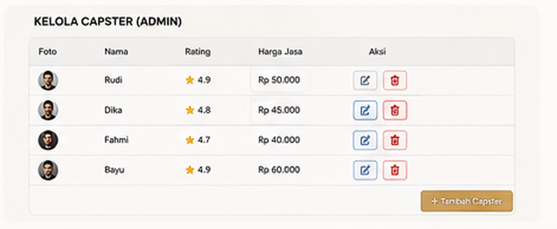

Halaman ini digunakan admin untuk:

* Melihat daftar capster.
* Menambah capster.
* Mengedit capster.
* Menghapus capster.
* Mengatur harga jasa dan rating capster.

---

### 29.18 Rekomendasi Struktur Halaman UI

```text
resources/views/
├── layouts/
│   ├── app.blade.php
│   ├── guest.blade.php
│   └── admin.blade.php
├── pages/
│   ├── home.blade.php
│   ├── services.blade.php
│   └── capsters.blade.php
├── member/
│   ├── dashboard.blade.php
│   ├── bookings/
│   │   ├── index.blade.php
│   │   ├── create.blade.php
│   │   ├── show.blade.php
│   │   └── review.blade.php
└── admin/
    ├── dashboard.blade.php
    ├── bookings/
    │   ├── index.blade.php
    │   └── show.blade.php
    ├── capsters/
    │   ├── index.blade.php
    │   ├── create.blade.php
    │   └── edit.blade.php
    ├── services/
    │   ├── index.blade.php
    │   ├── create.blade.php
    │   └── edit.blade.php
    └── schedules/
        ├── index.blade.php
        ├── create.blade.php
        └── edit.blade.php
```

---

### 29.19 Komponen UI yang Dibutuhkan

| Komponen | Digunakan Pada | Keterangan |
|---|---|---|
| Navbar | User homepage | Navigasi utama website |
| Hero Section | Landing page | Headline dan CTA booking |
| Service Card | Homepage dan booking | Menampilkan layanan dan harga |
| Capster Card | Homepage dan booking | Menampilkan foto, rating, dan harga jasa capster |
| Booking Stepper | Booking page | Step layanan, capster, jadwal, ringkasan |
| Status Badge | Booking list | Menampilkan status booking |
| WhatsApp Button | Admin booking | Redirect konfirmasi ke WhatsApp |
| Review Form | User review | Rating dan komentar capster |
| Admin Sidebar | Dashboard admin | Navigasi halaman admin |
| Data Table | Admin CRUD | Kelola capster, layanan, booking |
| Email Template | Notification | Notifikasi reschedule dan pembatalan |

---

### 29.20 Catatan Implementasi Responsive

Untuk tampilan mobile:

* Gunakan layout satu kolom.
* Service card dibuat full width.
* Booking wizard dipisah per step.
* Bottom navigation dapat digunakan untuk menu utama member.
* Tabel admin sebaiknya dibuat responsive dengan horizontal scroll.
* Tombol utama harus mudah ditekan di layar kecil.

Untuk tampilan desktop:

* Gunakan container besar dengan grid 2 sampai 4 kolom.
* Homepage dapat menggunakan hero image besar.
* Dashboard admin menggunakan sidebar tetap.
* Booking wizard dapat ditampilkan dalam beberapa kolom agar proses booking terlihat lengkap.

## 27. Roadmap Pengembangan

Fitur yang dapat dikembangkan selanjutnya:

* Integrasi payment gateway.
* Integrasi WhatsApp API resmi.
* Kalender booking real-time.
* Reminder email sebelum jadwal booking.
* Reminder WhatsApp otomatis.
* Sistem deposit booking.
* Sistem voucher dan promo.
* Sistem membership level.
* Dashboard statistik penjualan.
* Laporan pendapatan harian/bulanan.
* Export laporan ke PDF/Excel.
* Multi cabang barbershop.
* Notifikasi realtime menggunakan Laravel Reverb.

---

## 28. Kesimpulan

GAZ Barbershop Booking System dirancang untuk mempermudah pelanggan melakukan booking barbershop secara online dan membantu admin mengelola proses operasional booking secara lebih rapi. Dengan sistem ini, user dapat memilih layanan, memilih capster sesuai jadwal, melihat total harga secara otomatis, mendapatkan notifikasi jika terlambat atau perlu reschedule, serta memberikan review setelah layanan selesai.

Admin dapat mengelola booking, mengonfirmasi pelanggan melalui WhatsApp, menerima atau menolak booking, mengelola capster, mengelola layanan, dan memastikan proses pembayaran serta penyelesaian layanan berjalan dengan baik.
